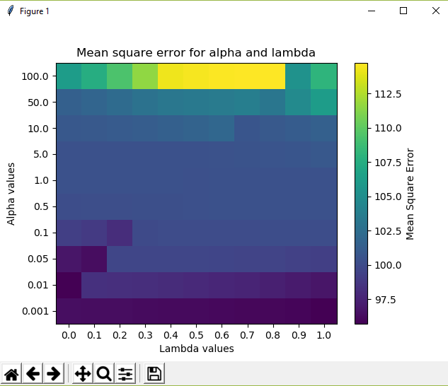
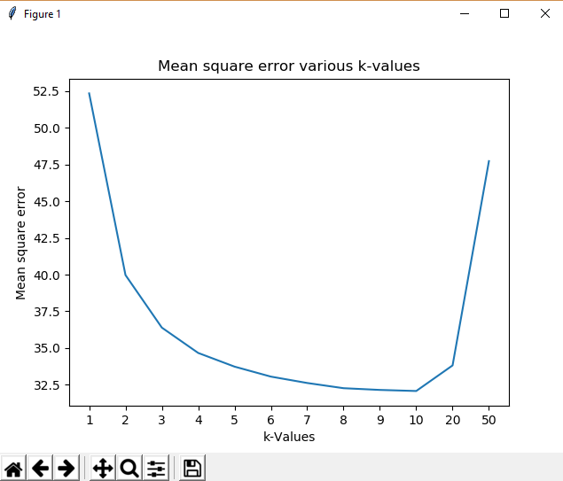
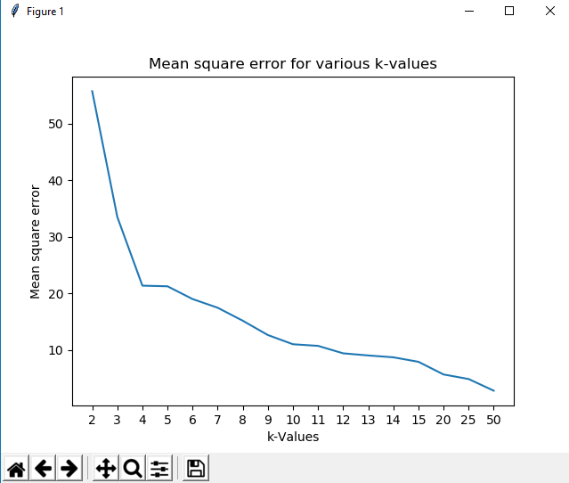

# PredictingParkinsons
Use various algorithms to predict Parkinsons using UCI dataset.

Dataset Used: [Parkinson's Disease Telemonitoring Dataset](https://archive.ics.uci.edu/ml/machine-learning-databases/parkinsons/telemonitoring/parkinsons_updrs.data), details [here](https://archive.ics.uci.edu/ml/machine-learning-databases/parkinsons/telemonitoring/parkinsons_updrs.names)

The predictand in this dataset is `total_UPDRS`. It is predicted using multiple algorithms (the graph show search for optimum _hyperparameters_):

## Regularized Linear Regression

## k-nn 

## K-means Clustering

